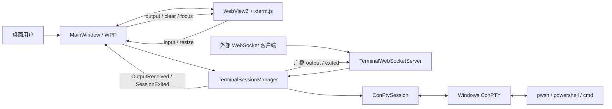
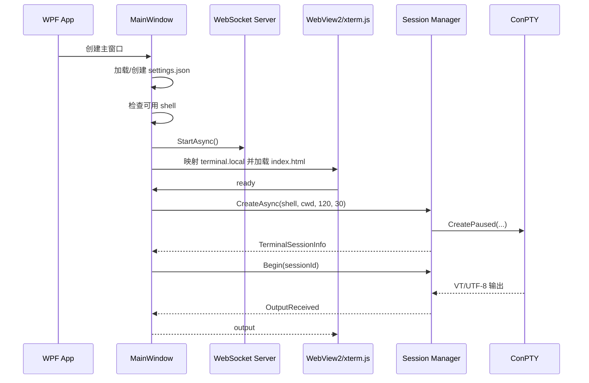

# TerminalHost 代码梳理

## 1. 项目定位

TerminalHost 是一个仅面向 Windows 的本地终端宿主。它不依赖 `wt.exe`，而是直接通过 Windows ConPTY 创建并控制 shell 进程，再用 WPF + WebView2 + xterm.js 显示终端画面。同时，程序在本机开放带令牌认证的 WebSocket API，允许外部程序创建和控制多个终端会话。

当前支持的 shell：

- PowerShell 7：`pwsh.exe -NoLogo`
- Windows PowerShell 5.1：`powershell.exe -NoLogo`
- CMD：`cmd.exe /Q`

技术栈：

- .NET 6 / C# 10
- WPF
- Microsoft WebView2 `1.0.1518.46`
- xterm.js + fit addon
- ASP.NET Core Kestrel / WebSocket
- Windows ConPTY / Win32 P/Invoke

## 2. 总体架构



代码按职责分为四层：

1. **桌面交互层**：`MainWindow.xaml` 和 `MainWindow.xaml.cs`，负责 UI、WebView2 初始化以及 GUI 当前会话。
2. **Web 终端渲染层**：`wwwroot/`，负责 xterm.js 初始化、键盘输入、VT 输出渲染和尺寸同步。
3. **会话与 ConPTY 层**：`Core/`，负责 shell 白名单解析、多会话管理、输入输出缓冲和原生进程生命周期。
4. **外部 API 层**：`Api/`，负责 Kestrel、令牌校验、WebSocket JSON 协议和事件广播。

## 3. 目录结构

```text
TerminalHost/
├─ TerminalHost.sln
├─ README.md
├─ CODE_OVERVIEW.md                 # 本文档
├─ clients/
│  ├─ powershell-client.ps1         # PowerShell API 示例
│  └─ python-client.py              # Python API 示例
├─ scripts/
│  ├─ build.ps1                     # Release 构建
│  ├─ clean-build.ps1               # 清理 bin/obj 后构建
│  └─ publish-win-x64.ps1           # 自包含 win-x64 发布
└─ src/TerminalHost.App/
   ├─ App.xaml(.cs)                 # WPF 入口
   ├─ MainWindow.xaml(.cs)          # 主窗口和 GUI 会话协调
   ├─ Infrastructure/
   │  └─ AppSettings.cs             # API 端口和令牌持久化
   ├─ Core/
   │  ├─ Models.cs                  # 请求、会话、事件模型
   │  ├─ ShellCommand.cs            # shell 白名单和命令行解析
   │  ├─ TerminalSessionManager.cs  # 多会话管理
   │  └─ ConPty/
   │     ├─ NativeMethods.cs        # Win32 API 声明
   │     └─ ConPtySession.cs        # 单个 ConPTY 会话
   ├─ Api/
   │  ├─ TerminalWebSocketServer.cs # WebSocket 服务及协议分发
   │  └─ WebSocketClientConnection.cs
   └─ wwwroot/
      ├─ index.html
      ├─ app.js
      ├─ styles.css
      └─ vendor/xterm/              # 本地化的 xterm.js 依赖
```

## 4. 程序启动流程



关键点：

- `MainWindow` 构造时加载设置、过滤系统中不存在的 shell，并订阅会话输出和退出事件。
- 窗口 `Loaded` 后先启动本地 API，再初始化 WebView2。
- xterm.js 首次发出 `ready` 后，GUI 才创建默认终端会话。
- 会话采用“先创建、后开始读取”的两阶段流程。API 的 `create` 响应会先发给调用方，然后才调用 `Begin`，从而避免 shell 的首屏输出早于 `created` 响应。

## 5. 核心模块

### 5.1 `MainWindow`

`MainWindow.xaml.cs` 是桌面端的协调器，持有一份共享的 `TerminalSessionManager` 和 `TerminalWebSocketServer`。

主要职责：

- 探测 `PATH`、应用目录、当前目录和 Windows 系统目录中的 shell 可执行文件。
- 启动 API 服务和 WebView2 页面。
- 在 WebView2 与会话管理器之间转发输入、输出和尺寸变化。
- 管理 GUI 当前展示的 `_activeSessionId`。
- 处理启动/重启、停止、清屏、复制 API 地址和复制会话 ID。
- 窗口关闭时依次释放 API 服务和全部终端会话。

GUI 目前只显示一个活动会话；通过 API 创建的其他会话仍由同一个管理器在后台运行。

### 5.2 WebView2 与 xterm.js

`wwwroot/app.js` 创建 xterm.js 实例并加载 `FitAddon`：

- `term.onData` 将原始按键数据作为 `{ type: "input", data }` 发给 WPF。
- `ResizeObserver` 在 40 ms 防抖后执行 `fit()`，再发送 `{ type: "resize", cols, rows }`。
- WPF 发来的 `output` 直接交给 `term.write()`，其中的 ANSI/VT 控制序列由 xterm.js 解释。
- 支持来自 WPF 的 `clear`、`reset` 和 `focus` 消息。
- `Ctrl+Shift+C` 且存在选区时，将选中文本写入剪贴板。

Web 内容通过虚拟主机 `https://terminal.local/` 映射到输出目录的 `wwwroot`。导航处理器会阻止跳转到该虚拟主机之外的地址。

### 5.3 `TerminalSessionManager`

这是 GUI 和 WebSocket API 共用的会话服务，内部使用 `ConcurrentDictionary<string, SessionEntry>` 保存多会话。

主要方法：

| 方法 | 作用 |
| --- | --- |
| `CreateAsync` | 校验 shell 和工作目录、限制尺寸、创建暂停态 ConPTY 会话并注册事件 |
| `Begin` | 启动输出泵和进程退出等待任务 |
| `List` / `Get` | 查询会话元数据 |
| `WriteAsync` | 向伪终端写入 UTF-8 原始数据 |
| `SendSignalAsync` | 将命名控制键转换为终端字符 |
| `Resize` | 调整 ConPTY 尺寸并更新会话信息 |
| `GetSnapshot` | 返回该会话保留的最近输出 |
| `StopAsync` | 优雅或强制停止，可选从管理器移除 |
| `RemoveAsync` | 移除并释放指定会话 |

尺寸会被限制在：

- 列数：20～500
- 行数：5～300

每个会话维护字符快照缓冲区。超过 1,000,000 字符时，会删除最旧内容并保留最近约 750,000 字符，防止每次只裁掉少量内容造成频繁搬移。

### 5.4 `ShellCommand`

`ShellCommand.Resolve` 是 shell 创建的安全边界之一。API 不能传入任意可执行文件，只能使用以下别名：

| 输入 | 实际命令 |
| --- | --- |
| `pwsh` / `powershell7` | `pwsh.exe -NoLogo` |
| `powershell` / `windowspowershell` | `powershell.exe -NoLogo` |
| `cmd` | `cmd.exe /Q` |

工作目录会展开环境变量、转换为绝对路径，并验证目录存在。

### 5.5 `ConPtySession`

`ConPtySession` 封装单个 Windows 伪控制台。创建过程如下：

1. 创建输入管道和输出管道。
2. 使用管道句柄调用 `CreatePseudoConsole`。
3. 初始化 `STARTUPINFOEX` 属性列表并写入伪控制台句柄。
4. 使用 `CreateProcessW` 在指定工作目录启动 shell。
5. 关闭宿主不再需要的管道端和进程线程句柄。
6. 保留输入写端、输出读端、伪控制台句柄和进程句柄。

`Begin()` 启动两个后台任务：

- `PumpOutputAsync`：按字节读取 ConPTY 输出，使用可跨读取边界的 UTF-8 `Decoder` 解码，再触发 `Output` 事件。
- `WaitForExit`：等待进程结束，读取退出码，触发 `Exited` 事件并关闭伪控制台。

写入由 `SemaphoreSlim` 串行化，避免 GUI 和多个 API 客户端并发写入时破坏字节顺序。

停止策略：

- 优雅停止：先写入 `exit\r`，等待 700 ms。
- 未退出或要求强制停止：关闭伪控制台，再等待最多 2 秒。
- 仍未退出：调用 `TerminateProcess(process, 1)`。

### 5.6 `NativeMethods`

`NativeMethods.cs` 集中声明 ConPTY 和进程管理所需的 Win32 API，包括：

- 管道：`CreatePipe`
- 伪控制台：`CreatePseudoConsole`、`ResizePseudoConsole`、`ClosePseudoConsole`
- 扩展启动信息：`InitializeProcThreadAttributeList`、`UpdateProcThreadAttribute`
- 进程：`CreateProcessW`、`WaitForSingleObject`、`GetExitCodeProcess`、`TerminateProcess`
- 句柄释放：`CloseHandle`

## 6. WebSocket API

### 6.1 服务入口和认证

- 监听地址：`127.0.0.1:<ApiPort>`，默认端口 `8765`
- 健康检查：`GET /health`
- WebSocket：`/ws?token=<ApiToken>`
- KeepAlive：30 秒
- 单条接收消息上限：4 MiB
- 仅接受文本 JSON WebSocket 消息

WebSocket 握手时使用固定时间比较校验令牌。认证成功后，服务端首先返回：

```json
{
  "type": "hello",
  "service": "TerminalHost",
  "protocol": 1,
  "sessions": []
}
```

### 6.2 请求动作

| action | 关键字段 | 成功响应 | 说明 |
| --- | --- | --- | --- |
| `create` | `shell?`, `cwd?`, `cols?`, `rows?` | `created` | 创建会话，响应后开始输出 |
| `list` | 无 | `sessions` | 查询全部会话 |
| `write` | `sessionId`, `data` | `ok` | 写入原始终端数据 |
| `signal` | `sessionId`, `signal` | `ok` | 发送控制键 |
| `resize` | `sessionId`, `cols`, `rows` | `ok` | 调整终端尺寸 |
| `snapshot` | `sessionId` | `snapshot` | 获取最近输出缓冲 |
| `stop` | `sessionId`, `graceful?`, `remove?` | `ok` | 停止会话，可选移除 |
| `ping` | 无 | `pong` | 应用层连通性检查 |

所有请求都可携带 `requestId`，响应会原样带回，便于客户端匹配异步请求和响应。解析或执行失败时返回：

```json
{
  "type": "error",
  "requestId": "原请求 ID",
  "error": "错误信息"
}
```

### 6.3 服务端主动事件

```json
{
  "type": "output",
  "sessionId": "会话 ID",
  "data": "UTF-8 文本及 ANSI/VT 序列"
}
```

```json
{
  "type": "exited",
  "sessionId": "会话 ID",
  "exitCode": 0
}
```

当前实现会把所有会话的 `output` 和 `exited` 事件广播给所有已认证客户端。客户端需要根据 `sessionId` 自行过滤。

### 6.4 控制键映射

| signal | 写入数据 |
| --- | --- |
| `ctrlC` / `ctrl+c` | `\x03` |
| `ctrlD` / `ctrl+d` | `\x04` |
| `escape` / `esc` | `\x1b` |
| `enter` | `\r` |

## 7. 配置与持久化

配置文件位置：

```text
%LOCALAPPDATA%\TerminalHost\settings.json
```

结构示例：

```json
{
  "ApiPort": 8765,
  "ApiToken": "随机令牌"
}
```

首次运行时使用 `RandomNumberGenerator.GetBytes(32)` 生成 256 位随机令牌，并转换为无填充的 URL-safe Base64。若配置文件缺失、损坏、端口无效或令牌过短，程序会生成新配置并覆盖原文件。

## 8. 会话模型和生命周期

`TerminalSessionInfo` 保存：

- `Id`：32 位无连字符 GUID 字符串
- `Shell`：规范化后的 shell 名称
- `CommandLine`：实际启动命令行
- `WorkingDirectory`：规范化绝对路径
- `Columns` / `Rows`：当前尺寸
- `StartedAt`：创建时间
- `IsRunning`：运行状态

生命周期：

```text
CreatePaused → 注册到 SessionManager → 绑定事件 → Begin
      ↓                                            ↓
   创建失败                                     Running
                                                   ↓
                                   自然退出 / StopAsync / DisposeAsync
                                                   ↓
                                                Stopped
                                                   ↓
                                      可保留快照，或 remove 后释放
```

## 9. 并发与资源释放

- 会话表使用 `ConcurrentDictionary`，支持多个 WebSocket 客户端并发操作。
- 单会话输入使用 `_writeLock` 保证顺序。
- 单 WebSocket 连接使用 `_sendLock`，避免广播和请求响应同时写 socket。
- 输出快照使用独立对象锁保护 `StringBuilder`。
- `Interlocked` 防止会话重复开始、重复停止和重复释放。
- 窗口关闭时先关闭所有 WebSocket 客户端和 Kestrel，再释放全部 ConPTY 会话。
- 原生句柄、管道、属性列表、取消令牌和信号量均有对应释放逻辑。

## 10. 安全边界

代码当前已经具备：

- Kestrel 只绑定 IPv4 loopback `127.0.0.1`。
- WebSocket 使用 256 位随机令牌认证，并固定时间比较令牌。
- shell 使用白名单，不能由 API 直接指定任意程序路径。
- 进程按宿主当前用户权限启动，manifest 使用 `asInvoker`，不会自动 UAC 提权。
- WebView2 阻止导航到 `terminal.local` 之外。
- WebSocket 单条消息限制为 4 MiB，终端尺寸和快照内存也有限制。

需要注意：

- 这是本地代码执行接口，获取令牌的进程可以在当前用户权限下执行任意 shell 命令。
- 令牌放在 WebSocket 查询字符串中，可能出现在诊断日志或监控信息里。
- `/health` 不要求认证，会暴露服务是否运行和当前会话数量。
- 所有认证客户端都能操作所有会话，也会收到所有会话输出；当前没有所有者或权限隔离。
- `settings.json` 没有在代码中显式收紧 ACL，安全性依赖用户目录默认权限。
- WebView2 开发者工具当前处于启用状态。

## 11. 构建与运行

环境要求：

- Windows 10 1809 或更高版本
- .NET 6 SDK
- Microsoft Edge WebView2 Runtime
- 如需 PowerShell 7，需安装 `pwsh.exe`

常用命令：

```powershell
# 清理并构建 Release
.\scripts\clean-build.ps1

# 普通 Release 构建
.\scripts\build.ps1

# 直接运行
dotnet run --project .\src\TerminalHost.App\TerminalHost.App.csproj

# 发布自包含 win-x64 版本
.\scripts\publish-win-x64.ps1
```

自包含发布输出：

```text
publish\win-x64\TerminalHost.exe
```

## 12. 外部客户端接入要点

仓库提供 PowerShell 和 Python 示例。通用接入流程为：

1. 从 GUI 复制带 token 的 WebSocket 地址。
2. 建立连接并接收 `hello`。
3. 发送带唯一 `requestId` 的 `create`。
4. 等待 `created`，记录 `session.id`。
5. 使用 `write` 发送命令；Enter 必须发送 `\r`。
6. 持续接收消息，并按 `sessionId` 过滤 `output` 和 `exited`。
7. 需要可靠判断命令完成时，在命令末尾追加唯一完成标记，不要依赖可变化的 shell 提示符。

需要显示完整终端画面的客户端必须具备 VT/ANSI 解析能力；直接打印字符串只适用于简单日志型消费。

## 13. 当前实现边界与可扩展方向

当前边界：

- GUI 是单活动会话界面，没有标签页或会话切换器。
- API 是协议版本 1，没有订阅机制、会话归属或角色权限。
- 快照保留的是原始 VT 数据，不是解析后的屏幕状态。
- 停止 shell 的优雅策略固定发送 `exit\r`，不区分具体 shell 状态。
- 服务仅支持 IPv4 loopback，端口固定由配置文件决定，没有 UI 配置入口。
- 没有自动化测试项目。

建议的扩展顺序：

1. 为 `ShellCommand`、工作目录校验、协议解析、尺寸边界和快照裁剪增加单元测试。
2. 增加会话订阅，避免所有客户端接收所有输出。
3. 为会话增加 owner/client scope，限制跨客户端控制。
4. 为 GUI 增加会话列表、切换和标签页。
5. 将请求/响应定义为强类型 DTO，并加入协议版本兼容策略。
6. 增加结构化日志、命令审计和可选的目录白名单。
7. 在发布配置中关闭 WebView2 DevTools，并评估令牌文件 ACL 与轮换机制。

## 14. 阅读代码的推荐顺序

若要继续维护该项目，建议按以下顺序阅读：

1. `MainWindow.xaml.cs`：先理解应用如何启动和串起各组件。
2. `TerminalSessionManager.cs`：理解统一的会话抽象。
3. `ConPtySession.cs`：理解底层进程、管道、输出泵和停止逻辑。
4. `NativeMethods.cs`：核对 Win32 调用和结构布局。
5. `TerminalWebSocketServer.cs`：理解外部协议和事件广播。
6. `wwwroot/app.js`：理解 UI 输入输出如何与 WPF 互通。
7. `clients/`：参考外部调用方式。
